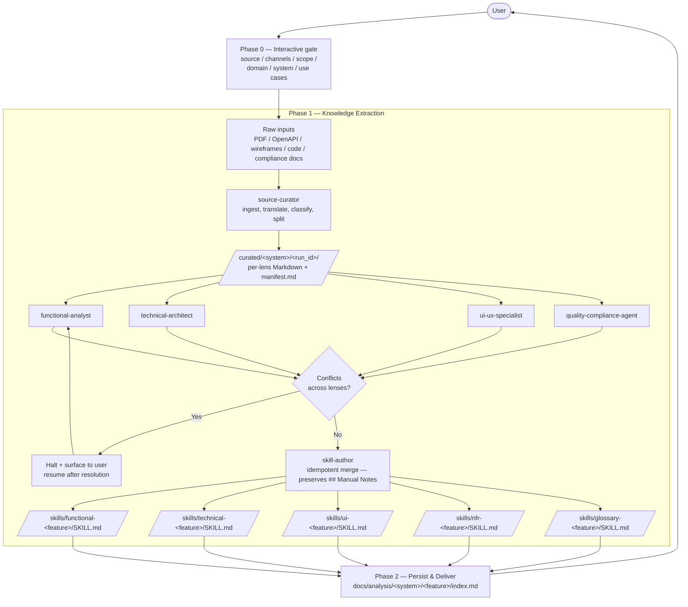

# input-analyzer

> **Maintained by**: Test Enablement — Technology
> **Category**: analysis
> **Maturity**: community
> **Version**: 1.1.0

## Companion plugins (foundational vocabulary)

This plugin **does not redefine** the specification vocabulary or the requirement-authoring rules — it relies on two companion knowledge plugins so every analyst lens, every emitted SKILL.md, and every downstream consumer (test-case-generator, coverage-checker) shares the same coordinate system.

| Companion | What it provides | Used by |
|---|---|---|
| [`input-hierarchization`](../input-hierarchization) | The canonical concept dictionary (Functional Domain, Capability, Asset, Dataset, Feature, Process, Activity, Task, Golden Data) and the 6-level system hierarchization tree (Domain → Requirement → Process → Step → Feature → Use Case / Acceptance Criterion). Defines what each input fragment IS and where it BELONGS. | The orchestrator and **all four lens agents** classify and place every retained fragment against this vocabulary. |
| [`ears`](../ears) | The five EARS patterns and the authoring/review checklist for requirement statements. | The **functional-analyst** validates every L2 (Requirement) finding against EARS and flags non-conformant statements as `needs-EARS-rewrite`. |

Both companion plugins are **read-only knowledge bundles** — no commands, no agents, no side effects. Install them alongside `input-analyzer`. Their skills auto-trigger when the input-analyzer's agents reason about classification, hierarchy, or requirement quality.

> Note: the two trees can read like they conflict — input-analyzer historically used `System → Business Domain → Sub-Domain → Feature → User Story → Use Case` while `input-hierarchization` uses `Domain → Requirement → Process → Step → Feature → Use Case`. They are **complementary views**: input-hierarchization is the *authoritative* concept layer; the input-analyzer's tree is a *delivery layout* for the emitted SKILL.md files. The orchestrator and analysts always classify against the input-hierarchization vocabulary first; the per-lens skill authoring then arranges the findings under the System/Domain/Sub-Domain/Feature/User-Story/Use-Case headings expected by `test-case-generator`.

---

## What it does

Multi-lens **feature analyzer**. Ingests heterogeneous sources — business requirements, technical specs, OpenAPI, UI docs, **existing codebases or monoliths under modernization**, compliance/legal documents — and emits **per-lens Claude Code skill files** documenting the system inside a 6-layer tree (System → Business Domain → Sub-Domain → Feature → User Story → Use Case). Use Cases decompose into atomic *Behavioral Skills* (Trigger / Logic Gate / State Mutation / Response Protocol). The emitted SKILL.md files **are the deliverable** — reusable feature documentation for the whole team.

Use it standalone for:

- Monolith decomposition / modernization scoping
- System audits
- Onboarding documentation
- Producing a feature-and-business-flow catalog by domain
- Mapping legacy code → new microservices

Or use it as the **upstream input for [`test-case-generator`](../test-case-generator)** — it consumes the same SKILL.md files to generate test scenarios.

---

## Workflow



`source-curator` ingests raw heterogeneous inputs (PDFs, OpenAPI, wireframes, code, compliance docs) and emits **AI-optimized Markdown files organized by domain** (functional / technical / ui-ux / non-functional) plus a routing manifest. Only the analyst lenses with material to analyze are dispatched in parallel. Conflicts between sources halt the process and surface to the user. After conflict resolution, `skill-author` writes **one Claude Code skill per non-empty lens** into `<project>/.claude/skills/<lens>-<feature-slug>/SKILL.md`. Re-runs **merge** into existing skills (the `## Manual Notes` section is always preserved).

---

## Installation

```shell
/plugin install input-analyzer@claude-code-marketplace
```

---

## Usage

```
/input-analyzer
```

You can pass an optional argument:

```
/input-analyzer TE-162 — Order creation flow
/input-analyzer path/to/spec.pdf
/input-analyzer ~/repos/epic-monolith
/input-analyzer https://confluence.example.com/page
```

### Phase 0 — answer the questions

The orchestrator will not proceed until you answer:

1. **Source material** — spec, OpenAPI, UI doc, code path, repo path (existing system / monolith), compliance doc, bug report
2. **Channels** — API, Web, Mobile, Hybrid
3. **Coverage scope** — headline features / +ACs (default) / exhaustive
4. **Domain context** — business domain (e.g. authentication, payments)
5. **System / EPIC** — for file routing (e.g. `parking-api`, `epic-monolith`)
6. **Use cases** — actor goals (or leave blank to derive)

### Tips

- **Multiple sources** (e.g. spec PDF + OpenAPI + UI mockup) — provide all of them; the four analysts will reconcile or surface conflicts.
- **Non-English sources** — fine; `source-curator` translates during curation. All output is English; original quotes are preserved.
- **Re-running** — merges into existing skills; `## Manual Notes` are preserved.
- **Hand off to test-case-generator** — once skills exist, run [`/test-case-generator`](../test-case-generator) to produce a test suite from them.

---

## Output

Two artifacts per run:

### 1. Per-lens Claude Code skills

Written to `<project>/.claude/skills/{functional|technical|ui|nfr|glossary}-<feature-slug>/SKILL.md` (folder is **lens-first** so all skills for a given perspective sort together).

Each lens skill captures the system feature's knowledge from one analytical perspective — entities, contracts, business rules, dependencies, NFRs — embedded inside a **6-layer tree** (System → Business Domain → Sub-Domain → Feature → User Story → Use Case) rendered as the `## Tree Location` breadcrumb. Use Cases are decomposed into atomic **Behavioral Skills** with the fields:

- `Trigger`
- `Logic Gate`
- `State Mutation`
- `Response Protocol`
- `Sub-domain Refs`
- `Source`

(One Behavioral Skill per acceptance criterion; IDs are stable: `{LENS}-{story_id}-{ac_id}`.)

Each lens skill also includes:

- a `### Diagrams` section with simple Mermaid diagrams (`flowchart` / `stateDiagram-v2` / `sequenceDiagram` / `erDiagram`) whenever a flow, lifecycle, or dependency graph is non-trivial;
- a `### Interfaces (cross-sub-domain exposure)` section listing what this sub-domain exposes to others — referenced via the Behavioral Skill's `Sub-domain Refs` field;
- the `glossary` lens skill (one per feature when acronyms / jargon / business expressions appear) preserves each term's specification name **verbatim** and adds an English translation only when needed.

These skills are reusable feature documentation for anyone working on the feature, and are the input contract for `test-case-generator`. Re-running on the same feature **merges** into existing skills; the `## Manual Notes` section is always preserved.

### 2. Domain analysis index

`docs/analysis/{system}/{feature-slug}/index.md` summarizing what was extracted: domains identified, business flows per domain, every emitted skill path, open questions / `[INCOMPLETE SPEC]` flags, and next steps.

---

## Components

### Slash command

| Command | Purpose |
|---|---|
| [`/input-analyzer`](commands/input-analyzer.md) | Entry point — runs Phase 0 → 2 |

### Agents

| Agent | Role |
|---|---|
| [`input-analyzer`](agents/input-analyzer.md) | Lead orchestrator |
| [`source-curator`](agents/source-curator.md) | Phase 1.0 — ingests raw inputs, emits domain-scoped Markdown files + routing manifest |
| `functional-analyst` | Phase 1 — business logic, ACs, rules, state lifecycles |
| `technical-architect` | Phase 1 — APIs, schemas, data models, dependencies |
| `ui-ux-specialist` | Phase 1 — navigation, screens, validations, A11y |
| `quality-compliance-agent` | Phase 1 — Security, Performance, Compliance, Reliability |
| `skill-author` | Phase 1 — writes one Claude Code skill per non-empty lens. Idempotent: merges into existing skills, preserves `## Manual Notes`. Surfaces non-blocking boundary warnings when a Behavioral Skill references a sub-domain that hasn't declared the referenced state. |

---

## Source

[easyparkgroup/claude-code-marketplace](https://github.com/easyparkgroup/claude-code-marketplace)
