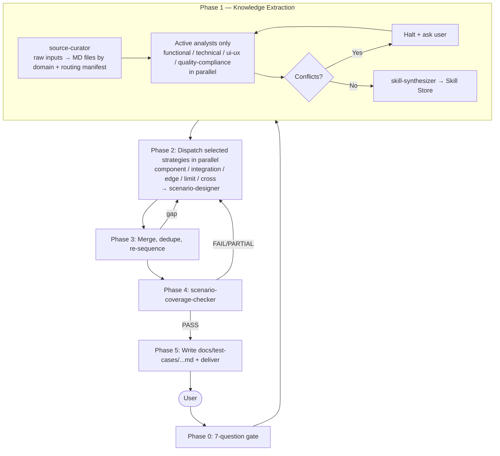

# test-case-generator

> **Maintained by**: Test Enablement — Technology
> **Category**: testing
> **Maturity**: community

## What it does

Converts business requirements, technical specs, UI docs, source code, or compliance documents into **domain-organized, tagged test scenario documents** — through a multi-dimensional analysis pipeline followed by 5 parallel testing strategies.

The plugin produces **technology-agnostic Markdown** — no code, no selectors, no endpoints. Any tester (manual or automated) can read them, and they are ready for downstream automated test code generation.

---

## Workflow



**Phase 1** starts with `source-curator`, which ingests raw heterogeneous inputs (PDFs, OpenAPI, wireframes, code, compliance docs) and emits **AI-optimized Markdown files organized by domain** (functional / technical / ui-ux / non-functional) plus a routing manifest. Only the analyst lenses that have material to analyze are then dispatched in parallel. A `skill-synthesizer` finally produces a **Skill Store** of Atomic Testable Units. Conflicts between sources halt the process and surface to the user.

**Phase 2** dispatches only the testing strategies you select:

| Strategy | Focus |
|---|---|
| **Component** | Individual units/entities in isolation |
| **Integration** | Interactions between sub-systems and services |
| **Edge Case** | Unusual, rare, or adversarial conditions |
| **Limit Case** | Boundary, min/max, empty/null values |
| **Cross Case** | Combinatorial/pairwise parameter interactions |

**Phase 3–4** dedupe redundant scenarios, merge multi-concern tests, and verify every acceptance criterion **and every NFR (Security, Performance, Compliance, Accessibility)** is covered.

---

## Installation

```shell
/plugin install test-case-generator@claude-code-marketplace
```

---

## Usage

### Invoke the slash command

```
/test-case-generator
```

You can pass an optional argument:

```
/test-case-generator TE-162 — Order creation flow
/test-case-generator path/to/spec.pdf
/test-case-generator https://confluence.example.com/page
```

### Phase 0 — answer the 7 questions

The orchestrator will not proceed until you answer:

1. **Source material** — spec, OpenAPI, UI doc, code path, compliance doc, bug report
2. **Channels** — API, Web, Mobile, Hybrid
3. **Testing levels** — Component / Integration / Edge / Limit / Cross (or All)
4. **Coverage scope** — happy path / +errors / full coverage
5. **Domain & append mode** — business domain; extend an existing TC file?
6. **System / EPIC** — for file routing (e.g. `parking-api`)
7. **Use cases** — actor goals (or leave blank to derive)

### Tips

- **Multiple sources** (e.g. spec PDF + OpenAPI + UI mockup) — provide all of them; the four analysts will reconcile or surface conflicts.
- **Append mode** — point the orchestrator at an existing `docs/test-cases/...md` file to enrich it without overwriting; existing TCs are detected and skipped.
- **Non-English sources** — fine; analysts translate during extraction. All output is English.
- **Iterate** — re-run with different testing levels or scopes against the same source; append mode keeps the document growing.

---

## Output

A structured Markdown document at `docs/test-cases/{system}/{story-id}-{slug}.md` containing:

- **YAML frontmatter** — system, domain, story, channel, total tests, use cases, AC coverage, NFR coverage, testing levels, append mode
- **Test cases** organized as Story/Scenario → Use Case → Layer → TC
- **Each TC** — ID, description, 4 mandatory tags, prerequisites, steps, assertions table, cleanup
- **Coverage Matrix** — TC × use case × layer × domain × strategy × severity
- **NFR Coverage Matrix** — every NFR ATU mapped to its TC(s)
- **Optimization Report** — raw scenarios → after dedupe → after multi-concern merge
- **Quality Checklist**

### Example TC

```markdown
##### TC-TE-123-001: Create Order — valid input produces new order with status "created"

**Tags**: `severity:smoke` `category:api` `domain:orders` `type:component-test`

**Prerequisites**:
- Authenticated user account exists

**Steps**:
1. User submits order with valid product ID and quantity
2. System processes the order request

**Assert**:
| Assertion | Expected Value | Type |
|-----------|---------------|------|
| Order status | "created" | state |
| Order ID returned | non-null UUID | schema |
| Inventory updated | quantity decremented | state |

**Cleanup**:
- Cancel and delete the test order
```

---

## Tag system

Every TC carries 4 mandatory tag categories. Additional `label:value` tags are allowed and preserved.

| Category | Values |
|---|---|
| **severity** | `smoke` / `mandatory` / `required` / `advisory` |
| **category** | `api` / `web` / `mobile` |
| **domain** | Per team (e.g. `payments`, `authentication`, `security`, `accessibility`) |
| **type** | `component-test` / `integration-test` / `edge-case` / `limit-case` / `cross-case` (comma-separated when a TC merges strategies) |

See the [`tag-system`](skills/tag-system/) skill for full rules.

---

## Components

### Slash command

| Command | Purpose |
|---|---|
| [`/test-case-generator`](commands/test-case-generator.md) | Entry point — runs the full 6-phase orchestration |

### Agents

| Agent | Role |
|---|---|
| [`test-case-generator`](agents/test-case-generator.md) | Lead orchestrator — Phase 0 → 5 |
| [`source-curator`](agents/source-curator.md) | Phase 1.0 — ingests raw inputs, emits domain-scoped Markdown files + routing manifest |
| `functional-analyst` | Phase 1 — business logic, ACs, rules, state lifecycles |
| `technical-architect` | Phase 1 — APIs, schemas, data models, dependencies |
| `ui-ux-specialist` | Phase 1 — navigation, screens, validations, A11y |
| `quality-compliance-agent` | Phase 1 — Security, Performance, Compliance, Reliability |
| `skill-synthesizer` | Phase 1 — produces the Skill Store from the 4 lenses |
| `component-strategy` | Phase 2 — single-unit isolation tests |
| `integration-strategy` | Phase 2 — cross-boundary interaction tests |
| `edge-case-strategy` | Phase 2 — unusual/adversarial conditions |
| `limit-case-strategy` | Phase 2 — boundary values |
| `cross-case-strategy` | Phase 2 — combinatorial/pairwise tests |
| `scenario-designer` | Phase 2 — converts strategy outputs into TC Markdown |
| `scenario-coverage-checker` | Phase 4 — PASS/FAIL/PARTIAL audit vs Skill Store + ACs |

### Skills

| Skill | Purpose |
|---|---|
| [`tag-system`](skills/tag-system/) | Mandatory 4-category tag rules and examples |
| [`git-standup`](skills/git-standup/) | Helper skill for reviewing recent test-related changes |

---

## Source

[easyparkgroup/claude-code-marketplace](https://github.com/easyparkgroup/claude-code-marketplace)
