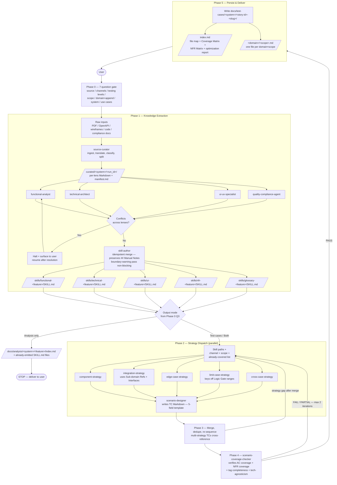

# test-case-generator

> **Maintained by**: Test Enablement — Technology
> **Category**: testing
> **Maturity**: community

## What it does

A **two-phase agent** built around a multi-dimensional knowledge-extraction pipeline.

**Phase 1 — Feature Analysis (the analysis step).** Ingests heterogeneous sources — business requirements, technical specs, OpenAPI, UI docs, **existing codebases or monoliths under modernization**, compliance/legal documents — and emits **per-domain Claude Code skill files** describing the system's features, business flows, entities, contracts, and NFRs inside a 6-layer tree (System → Business Domain → Sub-Domain → Feature → User Story → Use Case). Use Cases decompose into atomic *Behavioral Skills* (Trigger / Logic Gate / State Mutation / Response Protocol). These skills are reusable feature documentation for the whole team.

**Phase 2 — Test Case Generation (optional).** Reads the skills and produces **domain-organized, tagged test scenario documents** via 5 parallel testing strategies. Output is technology-agnostic Markdown — no code, no selectors, no endpoints.

You choose the output mode at Phase 0 Q3:

| Output mode | What you get | Typical use |
|---|---|---|
| **Analysis only** | Per-domain SKILL.md files + a domain index. **No test cases.** | Monolith decomposition, modernization scoping, system audits, onboarding docs, producing a feature catalog from an existing codebase, mapping legacy → new microservices |
| **Test cases only** | Domain × scope test scenario suite (assumes skills already exist) | Re-running test generation after manually editing skills |
| **Both** (default) | Both artifacts | Greenfield feature with spec + tests |

---

## Workflow



**Phase 1** starts with `source-curator`, which ingests raw heterogeneous inputs (PDFs, OpenAPI, wireframes, code, compliance docs) and emits **AI-optimized Markdown files organized by domain** (functional / technical / ui-ux / non-functional) plus a routing manifest. Only the analyst lenses that have material to analyze are then dispatched in parallel. Conflicts between sources halt the process and surface to the user. After conflict resolution, `skill-author` writes **one Claude Code skill per non-empty lens** (functional / technical / ui / nfr / glossary) into `<project>/.claude/skills/<lens>-<feature-slug>/SKILL.md`. Each skill embeds the feature inside a 6-layer tree (System → Business Domain → Sub-Domain → Feature → User Story → Use Case) and decomposes Use Cases into atomic **Behavioral Skills** (Trigger / Logic Gate / State Mutation / Response Protocol / Sub-domain Refs / Source) — making feature documentation a reusable artifact for the whole team. Re-runs **merge** into existing skills (the `## Manual Notes` section is always preserved).

**Phase 2** dispatches only the testing strategies you select:

| Strategy | Focus |
|---|---|
| **Component** | Individual units/entities in isolation |
| **Integration** | Interactions between sub-systems and services |
| **Edge Case** | Unusual, rare, or adversarial conditions |
| **Limit Case** | Boundary, min/max, empty/null values |
| **Cross Case** | Combinatorial/pairwise parameter interactions |

**Phase 3–4** dedupe redundant scenarios, merge multi-concern tests, and verify every acceptance criterion **and every NFR (Security, Performance, Compliance, Accessibility)** is covered.

---

## Installation

```shell
/plugin install test-case-generator@claude-code-marketplace
```

---

## Usage

### Invoke the slash command

```
/test-case-generator
```

You can pass an optional argument:

```
/test-case-generator TE-162 — Order creation flow
/test-case-generator path/to/spec.pdf
/test-case-generator https://confluence.example.com/page
```

### Phase 0 — answer the 7 questions

The orchestrator will not proceed until you answer:

1. **Source material** — spec, OpenAPI, UI doc, code path, repo path (existing system / monolith), compliance doc, bug report
2. **Channels** — API, Web, Mobile, Hybrid
3. **Output mode & testing levels** —
   - **Analysis only** → emit per-domain SKILL.md feature docs and stop (no testing levels needed)
   - **Test cases only** or **Both** → also pick from Component / Integration / Edge / Limit / Cross (or All)
4. **Coverage scope** — happy path / +errors / full coverage
5. **Domain & append mode** — business domain; extend an existing TC file?
6. **System / EPIC** — for file routing (e.g. `parking-api`, `epic-monolith`, `contracts-service`)
7. **Use cases** — actor goals (or leave blank to derive)

### Analysis-only example

```
/test-case-generator analysis: ~/repos/epic-monolith
```

Phase 0 Q3 → "Analysis only". The plugin will:
1. `source-curator` reads the codebase / spec inputs and routes per lens.
2. Analysts extract features, business flows, entities, NFRs by domain.
3. `skill-author` writes one SKILL.md per (lens × feature) into `<project>/.claude/skills/`.
4. Phase 5 §8.5 writes `docs/analysis/<system>/<feature>/index.md` summarizing the domains, business flows, and skill files emitted — **then stops**.

You can later run `/test-case-generator` again with mode "Test cases only" to generate scenarios from those skills without re-analyzing.

### Tips

- **Multiple sources** (e.g. spec PDF + OpenAPI + UI mockup) — provide all of them; the four analysts will reconcile or surface conflicts.
- **Append mode** — point the orchestrator at an existing `docs/test-cases/...md` file to enrich it without overwriting; existing TCs are detected and skipped.
- **Non-English sources** — fine; analysts translate during extraction. All output is English.
- **Iterate** — re-run with different testing levels or scopes against the same source; append mode keeps the document growing.

---

## Output

The plugin produces **two artifacts** per run:

### 1. Per-lens Claude Code skills

Written to `<project>/.claude/skills/{functional|technical|ui|nfr|glossary}-<feature-slug>/SKILL.md` (folder is **lens-first** so all skills for a given perspective sort together). Each skill captures the system feature's knowledge from one analytical lens — entities, contracts, business rules, dependencies, NFRs — embedded inside a **6-layer tree** (System → Business Domain → Sub-Domain → Feature → User Story → Use Case) rendered as the `## Tree Location` breadcrumb. Use Cases are decomposed into atomic **Behavioral Skills** with five fields: `Trigger / Logic Gate / State Mutation / Response Protocol / Sub-domain Refs / Source` (one Behavioral Skill per acceptance criterion, IDs are stable: `{LENS}-{story_id}-{ac_id}`).

Each lens skill also includes:
- a `### Diagrams` section with simple Mermaid diagrams (`flowchart` / `stateDiagram-v2` / `sequenceDiagram` / `erDiagram`) whenever a flow, lifecycle, or dependency graph is non-trivial;
- a `### Interfaces (cross-sub-domain exposure)` section listing what this sub-domain exposes to others — referenced via the Behavioral Skill's `Sub-domain Refs` field;
- the `glossary` lens skill (one per feature when acronyms / jargon / business expressions appear) preserves each term's specification name **verbatim** and adds an English translation only when needed.

These skills are reusable feature documentation for anyone working on the feature, and are also the input contract for Phase 2. Re-running on the same feature **merges** into the existing skills; the `## Manual Notes` section is always preserved across re-runs.

### 2. The test scenario suite — split across multiple files

Test cases are written to a **directory**, not a single file. Each `(domain × scope)` pair gets its own scope file, and an `index.md` at the root provides metadata, the file map, the coverage matrix, and the NFR coverage matrix.

```
docs/test-cases/{system}/{story-id}-{slug}/
├── index.md                                  # frontmatter + matrices + file map
├── payments/
│   ├── component-tests.md
│   ├── integration-tests.md
│   └── edge-cases.md
├── security/
│   ├── edge-cases.md
│   └── limit-cases.md
└── accessibility/
    └── component-tests.md
```

- **`index.md`** holds the run frontmatter, the file map, the **Coverage Matrix** (TC × use case × layer × domain × scope × severity × file), the **NFR Coverage Matrix**, the optimization report, and the quality checklist.
- **Scope files** group their TCs by use case. Empty scope files are not emitted.
- A TC merged across multiple strategies lives in its primary scope file and is cross-referenced from the secondary one.

### Standard TC template (mandatory)

Every TC, in every file, follows this exact template — four content sections plus a tags line:

````markdown
### TC-TE-123-001

**Title**: Create order with valid input produces a new order in "created" state

**Test description**: Validates that a successful order submission creates a new order resource and decrements stock — the user-visible outcome is an order confirmation, the technical contract under test is that the order entity is persisted in `created` status, an inventory state change is committed atomically with the order, and the response payload exposes the new order id. Covers AC-3 from S1 (functional spec).

**Tags**: `severity:smoke` `category:api` `domain:orders` `type:component-test`

**Inputs**:
| Name | Value / Range | Notes |
|------|---------------|-------|
| Authentication | Logged-in user | Precondition |
| Product id | Valid catalog id | Stock ≥ 1 |
| Quantity | 1 | Within min/max |
| Post-test cleanup | Cancel + delete the test order | Required |

```gherkin
Scenario: TC-TE-123-001 — Create order with valid input
  Given the user is authenticated
  And the product catalog contains the product with stock ≥ 1
  When the user submits an order with quantity 1 for that product
  Then the order is created with status "created"
  And the order id returned is a non-null UUID
  And the inventory is decremented by the ordered quantity
```
````

---

## Tag system

Every TC carries 4 mandatory tag categories. Additional `label:value` tags are allowed and preserved.

| Category | Values |
|---|---|
| **severity** | `smoke` / `mandatory` / `required` / `advisory` |
| **category** | `api` / `web` / `mobile` |
| **domain** | Per team (e.g. `payments`, `authentication`, `security`, `accessibility`) |
| **type** | `component-test` / `integration-test` / `edge-case` / `limit-case` / `cross-case` (comma-separated when a TC merges strategies) |

See the [`tag-system`](skills/tag-system/) skill for full rules.

---

## Components

### Slash command

| Command | Purpose |
|---|---|
| [`/test-case-generator`](commands/test-case-generator.md) | Entry point — runs the full 6-phase orchestration |

### Agents

| Agent | Role |
|---|---|
| [`test-case-generator`](agents/test-case-generator.md) | Lead orchestrator — Phase 0 → 5 |
| [`source-curator`](agents/source-curator.md) | Phase 1.0 — ingests raw inputs, emits domain-scoped Markdown files + routing manifest |
| `functional-analyst` | Phase 1 — business logic, ACs, rules, state lifecycles |
| `technical-architect` | Phase 1 — APIs, schemas, data models, dependencies |
| `ui-ux-specialist` | Phase 1 — navigation, screens, validations, A11y |
| `quality-compliance-agent` | Phase 1 — Security, Performance, Compliance, Reliability |
| `skill-author` | Phase 1 — writes one Claude Code skill per non-empty lens (functional / technical / ui / nfr / glossary) into `<project>/.claude/skills/<lens>-<feature-slug>/`. Embeds the 6-layer System → Business Domain → Sub-Domain → Feature → User Story → Use Case tree and decomposes Use Cases into atomic Behavioral Skills. Idempotent: merges into existing skills, preserves `## Manual Notes`. Surfaces non-blocking boundary warnings when a Behavioral Skill references a sub-domain that hasn't declared the referenced state in its `### Interfaces` section. |
| `component-strategy` | Phase 2 — single-unit isolation tests |
| `integration-strategy` | Phase 2 — cross-boundary interaction tests |
| `edge-case-strategy` | Phase 2 — unusual/adversarial conditions |
| `limit-case-strategy` | Phase 2 — boundary values |
| `cross-case-strategy` | Phase 2 — combinatorial/pairwise tests |
| `scenario-designer` | Phase 2 — converts strategy outputs into TC Markdown |
| `scenario-coverage-checker` | Phase 4 — PASS/FAIL/PARTIAL audit; reads Behavioral Skills and ACs from the per-lens SKILL.md files emitted by `skill-author` |

### Skills

| Skill | Purpose |
|---|---|
| [`tag-system`](skills/tag-system/) | Mandatory 4-category tag rules and examples |
| [`git-standup`](skills/git-standup/) | Helper skill for reviewing recent test-related changes |

---

## Source

[easyparkgroup/claude-code-marketplace](https://github.com/easyparkgroup/claude-code-marketplace)
