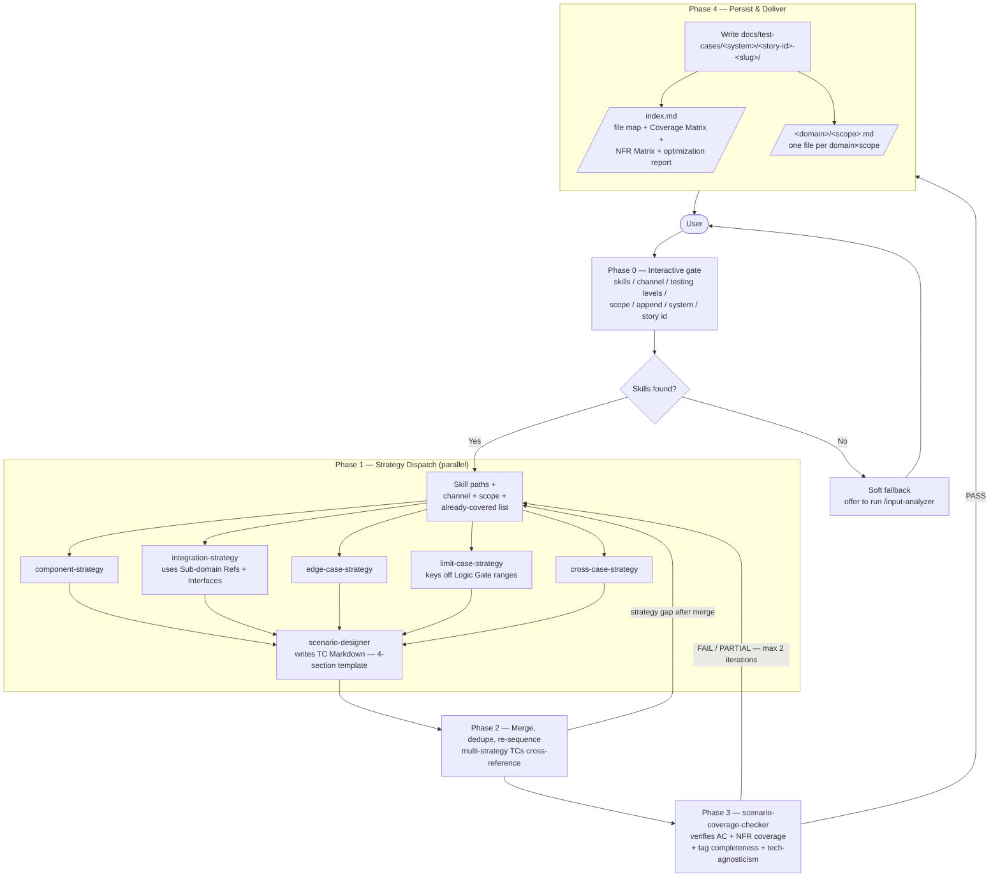

# test-case-generator

> **Maintained by**: Test Enablement — Technology
> **Category**: testing
> **Maturity**: community
> **Version**: 2.0.0

## What it does

Reads per-lens Claude Code **SKILL.md** files (functional / technical / ui / nfr / glossary) and produces a **domain-organized, tagged test scenario suite** by dispatching 5 parallel testing strategies — Component, Integration, Edge Case, Limit Case, Cross Case. Output is technology-agnostic Markdown — no code, no selectors, no endpoints.

> **Upstream dependency.** This plugin consumes SKILL.md files. If you don't have them, run [`/input-analyzer`](../input-analyzer) first — it produces them. If `/test-case-generator` is invoked and no skills are found, it offers a **soft fallback** that points you to `/input-analyzer` rather than failing.

> **Breaking change in 2.0.0.** Phase 1 (knowledge extraction) was extracted into the standalone `input-analyzer` plugin. This plugin no longer ingests raw specs/OpenAPI/code — it now expects pre-existing per-lens skills as input.

---

## Workflow



The 5 strategies:

| Strategy | Focus |
|---|---|
| **Component** | Individual units/entities in isolation |
| **Integration** | Interactions between sub-systems and services (driven by `Sub-domain Refs` and `### Interfaces`) |
| **Edge Case** | Unusual, rare, or adversarial conditions |
| **Limit Case** | Boundary, min/max, empty/null values |
| **Cross Case** | Combinatorial/pairwise parameter interactions |

Phases 2–3 dedupe redundant scenarios, merge multi-concern tests, and verify every acceptance criterion **and every NFR (Security, Performance, Compliance, Accessibility)** is covered.

---

## Installation

```shell
/plugin install test-case-generator@claude-code-marketplace
```

Recommended: also install `input-analyzer` from the same marketplace.

---

## Usage

### 1. Produce skills first (one-time per feature)

```
/input-analyzer ~/repos/my-service        # or a spec path / URL
```

This writes per-lens SKILL.md files under `<project>/.claude/skills/{functional|technical|ui|nfr|glossary}-<feature-slug>/`.

### 2. Generate test cases from those skills

```
/test-case-generator
```

You can pass an optional argument:

```
/test-case-generator TE-162               # feature-slug for skill discovery
/test-case-generator path/to/SKILL.md     # explicit skill path
```

### Phase 0 — answer the questions

The orchestrator will not proceed until you answer:

1. **Skill files** — explicit paths, a feature-slug for discovery, or trigger the soft fallback to `/input-analyzer`
2. **Channels** — API, Web, Mobile, Hybrid
3. **Testing levels** — Component / Integration / Edge / Limit / Cross (or All)
4. **Coverage scope** — happy path / +errors / full coverage
5. **Append mode** — extend an existing TC suite?
6. **System / EPIC** — for file routing (e.g. `parking-api`, `epic-monolith`)
7. **Story ID** — used for TC ids and the run directory name

### Soft fallback when skills are missing

If no SKILL.md files are found for the feature, the plugin asks:

```
A. Run /input-analyzer now to produce the skills
B. Provide the SKILL.md paths manually
C. Cancel
```

It does **not** halt with an error.

### Tips

- **Append mode** — point the orchestrator at an existing `docs/test-cases/<system>/<story>-<slug>/` directory to enrich it; existing TCs are detected by id and skipped.
- **Iterate** — re-run with different testing levels or scopes against the same skills.
- **Manual SKILL.md edits** — re-running `/input-analyzer` preserves your `## Manual Notes` section, so it's safe to refine skills by hand.

---

## Output

Test cases are written to a **directory**, not a single file. Each `(domain × scope)` pair gets its own scope file, and an `index.md` at the root provides metadata, the file map, the coverage matrix, and the NFR coverage matrix.

```
docs/test-cases/{system}/{story-id}-{slug}/
├── index.md                                  # frontmatter + matrices + file map
├── payments/
│   ├── component-tests.md
│   ├── integration-tests.md
│   └── edge-cases.md
├── security/
│   ├── edge-cases.md
│   └── limit-cases.md
└── accessibility/
    └── component-tests.md
```

- **`index.md`** holds the run frontmatter, the file map, the **Coverage Matrix** (TC × use case × layer × domain × scope × severity × file), the **NFR Coverage Matrix**, the optimization report, and the quality checklist.
- **Scope files** group their TCs by use case. Empty scope files are not emitted.
- A TC merged across multiple strategies lives in its primary scope file and is cross-referenced from the secondary one.

### Standard TC template (mandatory)

Every TC, in every file, follows this exact template — four content sections plus a tags line:

````markdown
### TC-TE-123-001

**Title**: Create order with valid input produces a new order in "created" state

**Test description**: Validates that a successful order submission creates a new order resource and decrements stock — the user-visible outcome is an order confirmation, the technical contract under test is that the order entity is persisted in `created` status, an inventory state change is committed atomically with the order, and the response payload exposes the new order id. Covers AC-3 from S1 (functional spec).

**Tags**: `severity:smoke` `category:api` `domain:orders` `type:component-test`

**Inputs**:
| Name | Value / Range | Notes |
|------|---------------|-------|
| Authentication | Logged-in user | Precondition |
| Product id | Valid catalog id | Stock ≥ 1 |
| Quantity | 1 | Within min/max |
| Post-test cleanup | Cancel + delete the test order | Required |

```gherkin
Scenario: TC-TE-123-001 — Create order with valid input
  Given the user is authenticated
  And the product catalog contains the product with stock ≥ 1
  When the user submits an order with quantity 1 for that product
  Then the order is created with status "created"
  And the order id returned is a non-null UUID
  And the inventory is decremented by the ordered quantity
```
````

---

## Tag system

Every TC carries 4 mandatory tag categories. Additional `label:value` tags are allowed and preserved.

| Category | Values |
|---|---|
| **severity** | `smoke` / `mandatory` / `required` / `advisory` |
| **category** | `api` / `web` / `mobile` |
| **domain** | Per team (e.g. `payments`, `authentication`, `security`, `accessibility`) |
| **type** | `component-test` / `integration-test` / `edge-case` / `limit-case` / `cross-case` (comma-separated when a TC merges strategies) |

See the [`tag-system`](skills/tag-system/) skill for full rules.

---

## Components

### Slash command

| Command | Purpose |
|---|---|
| [`/test-case-generator`](commands/test-case-generator.md) | Entry point — runs Phase 0 → 4 |

### Agents

| Agent | Role |
|---|---|
| [`test-case-generator`](agents/test-case-generator.md) | Lead orchestrator |
| `component-strategy` | Phase 1 — single-unit isolation tests |
| `integration-strategy` | Phase 1 — cross-boundary interaction tests |
| `edge-case-strategy` | Phase 1 — unusual/adversarial conditions |
| `limit-case-strategy` | Phase 1 — boundary values |
| `cross-case-strategy` | Phase 1 — combinatorial/pairwise tests |
| `scenario-designer` | Phase 1 — converts strategy outputs into TC Markdown |
| `scenario-coverage-checker` | Phase 3 — PASS/FAIL/PARTIAL audit; reads Behavioral Skills and ACs from per-lens SKILL.md files |

### Skills

| Skill | Purpose |
|---|---|
| [`tag-system`](skills/tag-system/) | Mandatory 4-category tag rules and examples |
| [`git-standup`](skills/git-standup/) | Helper skill for reviewing recent test-related changes |


## Source

[easyparkgroup/claude-code-marketplace](https://github.com/easyparkgroup/claude-code-marketplace)
