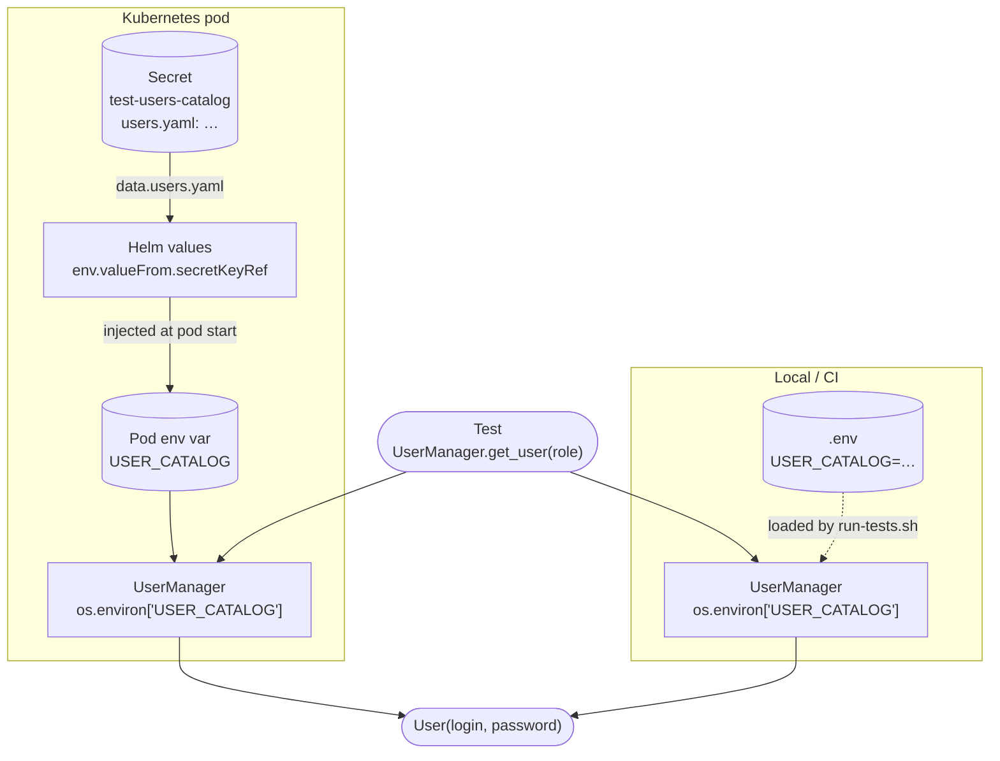

# Skill 13 — User Management

## Flow Overview



---

## Scope

`UserManager` reads the `USER_CATALOG` environment variable directly — a YAML string
mapping role names to `{login, password}`. There is no intermediate config file or
source dispatch: the same variable is used in every environment.

All credential access goes through `UserManager` — never read `os.environ` directly in tests, business, or core code.

---

## Catalog Format

`USER_CATALOG` must decode to a YAML mapping of role → credential field dict. No specific
field is required — any non-empty mapping is valid. All fields are accessible via `user.get()`;
`login` and `password` are also available as convenience properties:

```yaml
# Classic login + password
default:
  login: user@example.com
  password: secret

# Login + password + extra factors
admin:
  login: admin@example.com
  password: hunter2
  token: my-api-token
  mfa_secret: TOTP_BASE32_SECRET

# Token-only service account
service_account:
  token: bearer-token

# Certificate-only account
cert_user:
  certificate: CERT_PEM_CONTENT
  key: PRIVATE_KEY_CONTENT
```

| Rule | Detail |
|------|--------|
| Required shape | Top-level YAML mapping of role → non-empty field dict |
| Required fields | None — any combination of fields is valid as long as the entry is not empty |
| Supported fields | `login`, `password`, `token`, `mfa_secret`, `certificate`, or any custom field |
| Extra roles | Harmless — unused roles are ignored |
| Catalog caching | Parsed once at `UserManager` init, then cached for the process lifetime |
| Missing env var | `ValueError: Environment variable 'USER_CATALOG' is not set or empty` |
| Invalid YAML | `ValueError: ... does not contain valid YAML` |
| Non-mapping YAML | `ValueError: ... must decode to a YAML mapping` |
| Missing role | `ValueError: No user found with role '...'` |
| Empty entry | `ValueError: ... is empty — at least one credential field is required` |

---

## Kubernetes Secret Layout

One Secret holds the full catalog for every role. Kubernetes (via Helm) decodes and injects it as a plain string env var — no base64 handling needed in the framework.

```yaml
apiVersion: v1
kind: Secret
metadata:
  name: test-users-catalog
  namespace: <your-namespace>
type: Opaque
stringData:
  users.yaml: |
    admin:
      login: admin@example.com
      password: hunter2
    readonly:
      login: readonly@example.com
      password: s3cret-ro
    support:
      login: support@example.com
      password: help-me-99
```

---

## Helm Wiring

Add one entry in the container's `env` block. All roles in the catalog are served from a single `secretKeyRef`.

```yaml
# k8s/helm/values-<env>.yaml
containers:
  - name: <test-runner>
    env:
      - name: USER_CATALOG
        valueFrom:
          secretKeyRef:
            name: test-users-catalog   # must match Secret metadata.name
            key: users.yaml            # must match the Secret data key
```

Kubernetes decodes the base64 Secret value automatically — `USER_CATALOG` in the pod contains the raw YAML string.

---

## Local Development

Set `USER_CATALOG` in `.env` (gitignored), using the same YAML format as the Secret.
Document the expected shape (without real credentials) in `.env.example`.

The singleton caches every resolved `User` — each role is fetched at most once per process regardless of how many tests request it.

---

## Adding a New Role

1. Add the role entry to the `USER_CATALOG` value in local `.env`
2. Add the same role entry to the Kubernetes Secret (`stringData.users.yaml`) and re-apply / rotate
3. Update `.env.example` to document the new role name and shape (no real credentials)
4. Call `UserManager.get_instance().get_user(role="<new-role>")` in tests

---

## Troubleshooting

| Symptom | Cause | Fix |
|---------|-------|-----|
| `ValueError: ... is not set or empty` | `USER_CATALOG` missing locally, or Helm `secretKeyRef` not wired | Local: check `.env` has `USER_CATALOG` set. K8s: verify `kubectl get secret test-users-catalog -n <ns>` exists and the Helm `env` entry is present |
| `ValueError: ... does not contain valid YAML` | Catalog payload is malformed | Local: fix the value in `.env`. K8s: inspect with `kubectl get secret ... -o jsonpath='{.data.users\.yaml}' \| base64 -d` |
| `ValueError: ... must decode to a YAML mapping` | Valid YAML but not a role→entry mapping | Rewrite the catalog as a top-level mapping of role → `{login, password}` |
| `ValueError: No user found with role '...'` | Role name not in catalog | Add the missing role to the catalog, or correct the role name passed to `get_user()` |
| `ValueError: ... is empty` | A catalog entry exists but has no fields | Add at least one credential field (`login`, `token`, `certificate`, etc.) to the entry |

### Quick diagnostic

```bash
# 1. Verify the Secret exists and is readable
kubectl get secret test-users-catalog -n <namespace>

# 2. Inspect the catalog payload
kubectl get secret test-users-catalog -n <namespace> \
  -o jsonpath='{.data.users\.yaml}' | base64 -d

# 3. Confirm the env var is present in the pod
kubectl exec -n <namespace> <pod-name> -- env | grep USER_CATALOG
```

---

## Self-Check

- [ ] No `os.environ` or file reads for credentials outside `UserManager`
- [ ] Every credential access uses `UserManager.get_instance().get_user(role=...)`
- [ ] Local: `.env` has `USER_CATALOG` set to a valid YAML catalog string
- [ ] Kubernetes: Helm values have a `secretKeyRef` entry wiring `test-users-catalog / users.yaml` → `USER_CATALOG`
- [ ] Every role passed to `get_user()` exists as a key in the catalog payload
- [ ] The catalog payload is a valid YAML mapping of role → `{login, password}` (no lists, no scalars)
- [ ] The Self-Check of Skill 11 (Security & Config) is also satisfied — this skill extends, does not replace, those rules

---

## Related

- **Skill 04 — Utils Catalog**: `UserManager` method signatures and usage.
- **Skill 11 — Security & Config**: credential rules and `.env.example` policy.
